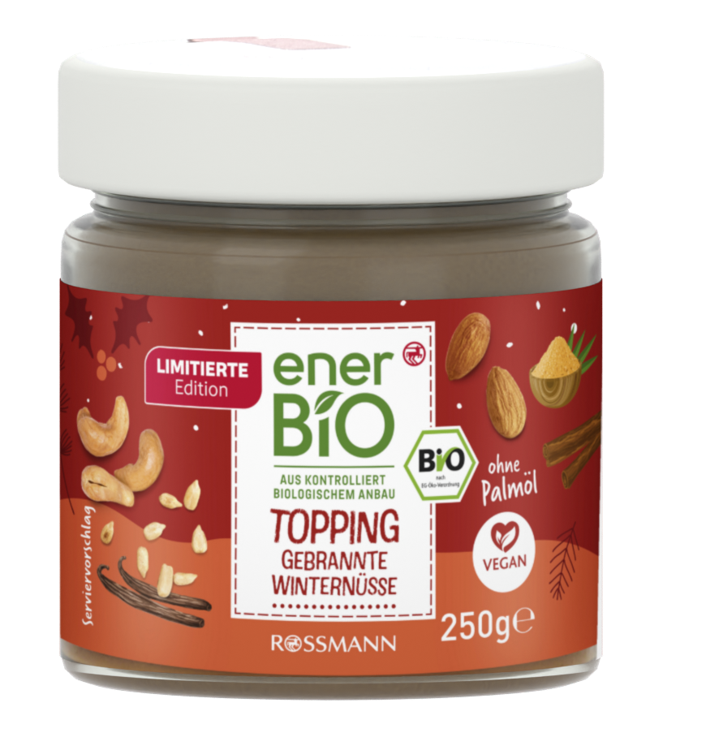

# Better Blender MCP

Higher-quality, repeatable Blender work with compact feedback and isolated heavy jobs.
A fork of [ahujasid/blender-mcp](https://github.com/ahujasid/blender-mcp), based on upstream
commit [`5f8ddaf`](https://github.com/ahujasid/blender-mcp/commit/5f8ddaf6e987c4aa0c3467fcc548838b28f64477).
Upstream documentation and attribution are preserved in [UPSTREAM.md](UPSTREAM.md).

## What changes

- **Five focused tools.** Scene deltas, staged edits, job control, background workers and explicit screenshots.
  Asset-service integrations remain available through the legacy `blender-mcp` entry point.
- **Quality checks at job completion.** Mesh boundaries, winding, degenerate faces, UV coverage,
  missing images, common procedural glTF risks, camera bounds and optional reference comparison.
  Eight findings inline; full evidence in a local JSON artifact.
- **Reusable geometry.** `blender://recipes` documents welded lathe meshes, single-vertex poles,
  corner UVs, cap atlases, PBR materials and camera aiming. Loaded only when requested.
- **Heavy work outside the GUI.** Rendering, baking and export run in separate Blender processes.
  Deadlines, cancellation, bounded logs, optional 30-second completion waits and durable job IDs.
- **Less recovery guesswork.** All live stages compile before mutation; IDs prevent duplicate jobs;
  timed-out socket commands are never automatically replayed. Worker source is snapshotted after validation.
- **Less UI blocking.** Queue work yields between commands; socket replies are sent by client threads.
  Known render/bake calls are rejected in live batches. Windows job objects clean up owned workers
  and their descendants if the MCP process exits abruptly.
- **No compact-mode telemetry.** No automatic before/after screenshots, full-scene snapshots,
  legacy integration imports or telemetry events on every modeling action.

Fewer calls alone do not improve art. These changes make it practical to build, inspect,
repair and re-render with useful evidence. They do not make arbitrary Python preemptible,
replace visual judgment or prove a general LLM-token reduction.

## Install

Python 3.10+ and Blender are required. Tested locally with Python 3.11 and Blender 5.2.1 LTS.
Use a checkout of this fork containing the enhancement:

```sh
uv sync --extra dev
uv run better-blender-mcp install-addon
```

Enable **Better Blender MCP** in Blender Preferences, then open the 3D viewport's
**MCP for Blender** sidebar and start the MCP server. Upgrades require reloading the
addon or restarting Blender. The installer updates recognized older copies and keeps a `.bak`.

Point your MCP client at the compact entry point. Example Codex configuration:

```toml
[mcp_servers.blender]
command = "uv"
args = ["--directory", "/absolute/path/to/better-blender-mcp", "run", "--no-sync", "better-blender-mcp"]
startup_timeout_sec = 30
tool_timeout_sec = 180

[mcp_servers.blender.env]
DISABLE_TELEMETRY = "true"
```

Use an absolute Windows path with forward slashes when applicable. Reconnect the MCP
client to load the five-tool schema after changing its configuration. `BLENDER_BINARY`
can supply the executable directly for workers that do not need a GUI connection.

To keep upstream's asset-service tools, run `blender-mcp` instead. Both entry points
use the improved transport. The enhanced addon retains upstream protocol 5 commands.

## A modeling iteration

1. Inspect the reference and subject. Match silhouette, proportions and camera first.
2. Create a reusable local Python recipe; import `lathe`, `pbr_material` or `point_at`
   from `better_blender` inside a worker. Save the editable scene explicitly.
3. Call `blender_worker` with `script_path`, a caller-chosen 32-character hexadecimal
   `job_id`, optional `reference_path`, and `wait_seconds: 30`.
4. Read the returned checks and artifact paths. Fix the specific defects, inspect the
   actual image, then render again. Audit an existing scene with only `blend_path`.
5. Use `blender_batch` for short live edits. Supply named stages and a stable job ID;
   inspect/cancel with `blender_job`. Query `blender_scene` with the previous revision
   as `since` to receive changed fields instead of another full page.

Example worker call:

```json
{
  "script_path": "/absolute/path/build_product.py",
  "job_id": "3d1e5e4ddc0f45f48e1fa7fd42f68251",
  "reference_path": "/absolute/path/reference.png",
  "timeout_seconds": 120,
  "wait_seconds": 30
}
```

Reusing an ID with identical inputs returns its existing state; changed inputs are
rejected. To inspect after a transport timeout, send only `job_id`. A worker inherits
no unsaved GUI state and never implicitly saves or renders. These are local Python
execution tools, not an operating-system sandbox.

[Architecture, limits and recovery](docs/architecture.md) ·
[Verification and measurement scope](docs/verification.md)

## Product reconstruction benchmark

The included enerBiO jar exercises geometry, source artwork, transparent glass,
material baking, rendering, export and lid motion. It is an editable Blender model;
the supporting browser loads its GLB using **Three.js r186**.



- [Blender scene](examples/product-studio/public/assets/winternuesse.blend)
- [Deterministic recipe](examples/product-studio/blender/build_product.py)
- [Before audit](benchmarks/quality-before.json) / [after audit](benchmarks/quality-after.json)
- [Measured MCP results](benchmarks/product-study.json)
- [Viewer and asset provenance](examples/product-studio/README.md)
- [Fotowelt station reconstruction](examples/fotowelt/README.md): a second reference
  with cabinetry, three kiosks, bent-plywood seating and packed photo artwork,
  built through the same enhanced MCP workers.

The automatic audit found 13 issues in the initial reconstruction. Repairs removed
open seams and collapsed UVs, joined the cap into a closed solid, and baked the nut
material for glTF. The final model passes these checks. This before/after comparison
is between iterations of this product, **not** a controlled upstream-versus-enhanced
LLM quality trial. Hidden surfaces and absolute dimensions remain inferred.

## Reproduce

With the product open in Blender and the enhanced addon running:

```sh
uv run --extra dev python tools/render_product.py
uv run --extra dev python tools/benchmark.py
uv run --extra dev python -m pytest -q
```

Set `BLENDER_BINARY` when running pytest to enable the real-Blender integration test.
The benchmark rebuilds the product assets and temporarily creates/removes its own
small collection in the open scene. Parser and schema baselines load the exact pinned
upstream source from Git history. No LLM is sampled and no billed tokens are counted.

Software: [MIT](LICENSE). The supplied reference photograph, artwork and packaging
marks retain their owners' rights; the software licence does not grant those rights.
