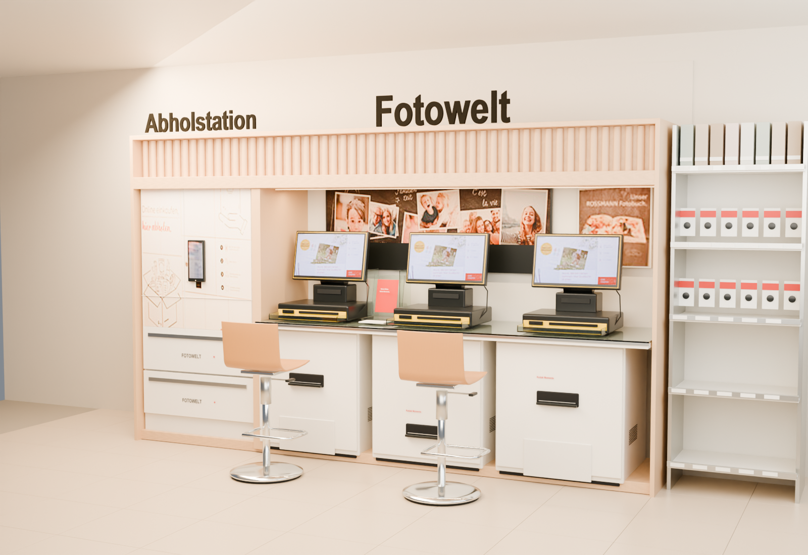

# Fotowelt photo station

An editable Blender reconstruction of the supplied Rossmann Fotowelt photograph,
built through the enhanced MCP's isolated worker tool.



[Open the Blender scene](output/fotowelt.blend) ·
[Source reference](assets/reference.jpeg) ·
[Full quality report](output/quality-report.json)

The station includes the 53 rounded maple slats, raised lettering, pickup lockers,
three tilted touchscreen kiosks, media readers, cables and glass trays, three floor
printers, two continuous bent-plywood stool shells, chrome pedestals and footrests,
photo-wall artwork and a leaflet stand. Retail shelving and the tiled floor occupy
a separate context collection. The three cameras cover the complete station, a
front elevation and a kiosk/stool detail.

The file opens in Material Preview. **Numpad 0** switches out of the camera;
**middle mouse** orbits. Components remain named and editable in collections 01–07.
Textures and fonts are packed. The Blender text block `READ ME | Fotowelt` contains
the same orientation notes.

Cabinet dimensions are estimated at **4.24 m wide × 0.80 m deep**. Hidden geometry,
physical size and unshown graphics cannot be recovered exactly from one photograph.
The reference supplies the poster, screen and locker artwork; these surfaces use
rectified source pixels. The lower collage backing omits foreground monitor pixels
that would otherwise incorrectly appear inside the poster. The wood grain is a
deterministic synthetic material, with a darker honey finish on the stools.

## Rebuild through Better Blender MCP

From the repository root, with the enhanced MCP configured in Codex and the Blender
addon listening on port 9876:

```sh
uv run --extra dev python examples/fotowelt/prepare_assets.py
uv run --extra dev python examples/fotowelt/run_mcp.py
uv run --extra dev python examples/fotowelt/run_mcp.py open
```

`run_mcp.py` reads the configured `blender` MCP command, verifies that it exposes
`blender_worker`, and sends the recipe through the actual stdio MCP protocol. The
worker snapshots and executes the recipe in a separate Blender process. Completion
returns the saved file, render and bounded audit; the harness saves the full audit
alongside the model. GUI scene loading uses `blender_batch` and `blender_job`.
The harness requires Python 3.11+ for `tomllib`.

The final audit covers every one of the station's 146 base meshes, including
boundaries, winding, degenerate geometry, image UVs and common material issues.
It excludes the optional shop context, curve/text topology and evaluated bevels.
No single-product silhouette score is reported: this retail photograph does not
meet that comparator's white-background assumption. Render inspection is still
necessary for perspective, artwork, highlights and overall resemblance.

The build record is [mcp-result.json](output/mcp-result.json). Its tool-call count
counts worker submission and completion waits, not asset preparation, inspection,
scene loading, prior iterations or total LLM tokens.

Source photograph, printed artwork, fonts and marks retain their owners' rights.
The repository's MIT software licence does not grant rights to those materials.
