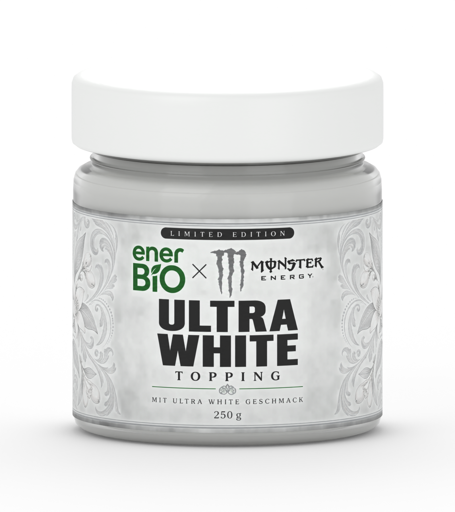

# enerBiO × Monster Energy — Ultra White

Fictional Limited Edition label applied to the existing, editable Blender jar.
White and silver filigree, black Ultra White typography and a green enerBiO
lockup, filled with white cream. The white enamel lid uses the original surface
normal map; the cream has a finer surface and subtle subsurface scattering.



## Files

- `label.png`: flat artwork, 2172 × 724 pixels; built-in `image_gen` output.
- `label-prompt.txt`: exact generation prompt. No CLI or external API key used.
- `ultra-white.blend`: packed scene with geometry, textures, lights and three cameras.
- `ultra-white-frontal.png`, `ultra-white-links.png`, `ultra-white-rechts.png`: actual
  Cycles renders, 1600 × 1800 pixels, 128 samples, opaque white background.
- `views.json`: camera angles, texture mapping scale and per-view render times.
- `quality-report.json`: automated worker audit; it does not measure aesthetic quality.

The 3:1 artwork segment retains its physical aspect ratio on the cylindrical
label. Its outer edges fade into unprinted white paper on the back. Geometry
and lighting come from the packed Winternüsse studio scene. The recipe replaces
the label, lid and filling materials and keeps the original files.

## Reproduce

From the repository root, using the configured compact Blender MCP:

```sh
uv run --extra dev python tools/render_product_views.py --variant ultra-white --preview
uv run --extra dev python tools/render_product_views.py --variant ultra-white
```

One isolated `blender_worker` job handles all three views; the client waits for
completion and saves the audit. Preview outputs go to `.local/ultra-white-previews`.
The recipe is `../blender/ultra_white.py`. The saved image is reused, so rebuilding
does not regenerate the label or require image generation access.

The recipe selects an available Cycles GPU backend inside the isolated worker
(OptiX, CUDA, HIP, Metal or oneAPI), falling back to CPU when no supported device
is available. It does not save user preferences. Set `ULTRA_WHITE_DEVICE=CPU` in
the client environment to force CPU rendering. `views.json` records the actual
backend and device; this run uses OptiX on an NVIDIA GeForce RTX 5070 Ti.

This is an independent design concept, not an official product or collaboration.
Packaging text describes the fictional concept, not a verified food recipe.
enerBiO and Monster Energy marks belong to their respective owners. Software
licensing does not grant trademark rights.

Brand reference: [Monster Zero Ultra / The White Monster](https://www.monsterenergy.com/en-au/energy-drinks/monster-ultra/zero-ultra/).
