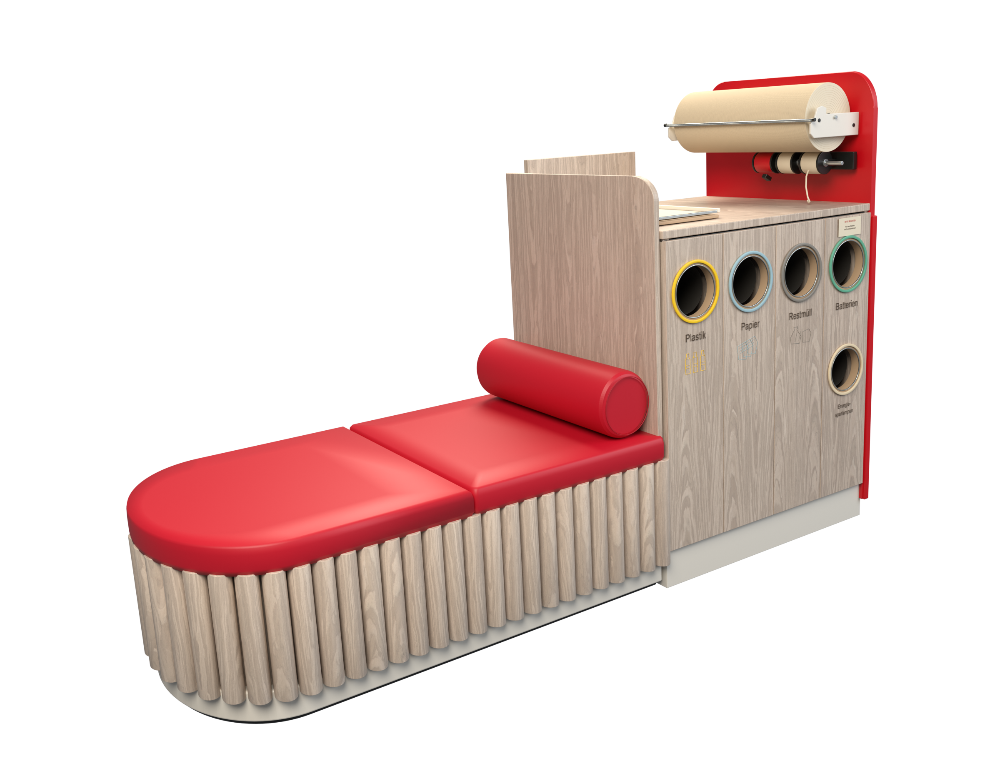

# Service station furniture

Editable Blender reconstruction from the two supplied Rossmann service-station photographs. Built and refined in the connected Blender instance through `blender-mcp`.

[Blender model](output/service-station.blend) · [Transparent render](output/service-station-preview.png) · [Front elevation](output/service-station-front.png) · [Dispenser detail](output/service-station-detail.png)



The active scene contains the furniture, cameras and lights. No shop surroundings, floor, people or basket. The pre-existing default scene is preserved separately.

- Two red seat cushions, curved oak-slat base and cylindrical bolster.
- Oak divider and four cabinet doors with five actual through-bores.
- Colored identification rims, dark chutes, German labels and pictograms.
- Right-end wrapping-paper dispenser, corrugated roll, brackets, tear bar, ribbon rolls and counter tray.
- Four cameras; 2400 × 1875 transparent Cycles hero render.
- 228 editable model objects, approximately 372,000 evaluated triangles.
- Two 2K textures and the lettering font packed into the `.blend` file.

Estimated envelope: **2.46 m × 0.84 m × 1.58 m above the floor**. Dimensions and hidden construction are inferred. The photographs do not establish a measurable 99% likeness. Fine printed artwork and unseen fittings are approximations.

Open `service-station.blend`; the furniture scene is active. **Numpad 0** exits camera view; **middle mouse** orbits. Components are grouped in collections 01–05. Studio equipment is in collection 90.

## Rebuild through Blender MCP

Execute each script in order using `execute_blender_code`, setting `__file__` to the script's absolute path:

```python
from pathlib import Path
folder = Path('/absolute/path/to/examples/service-station')
for name in ('build_scene.py', 'finalize_scene.py'):
    path = folder / name
    namespace = {'__file__': str(path), '__name__': '__main__'}
    exec(compile(path.read_text(encoding='utf-8'), str(path), 'exec'), namespace)
result = namespace['result']
```

`build_scene.py` replaces only its named furniture scene on reruns. `finalize_scene.py` renders three views, validates packed assets and finite geometry, writes [quality-report.json](output/quality-report.json), and saves the scene. Tested in Blender 5.2.1 LTS with Cycles/OptiX.

`fit_camera.py` is the optional preliminary camera-calibration study. It changes the active camera and render size; rerun the build scripts afterward to restore the delivery setup. Its landmark residual measures selected 2D points, not overall likeness.

Oak color and normal maps: [Oak Veneer 01, Poly Haven](https://polyhaven.com/a/oak_veneer_01), CC0. Wood color is adjusted in the shader to match the light finish in the photographs. Reference photographs remain in the user's Downloads folder and are not redistributed here.
